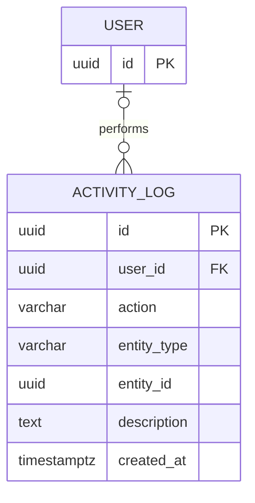

# Activity Log ERD Contribution

Owner: Syed Sayeel Abbas

Module: Activity Log / audit trail

## Entity and attributes

| Attribute | PostgreSQL type | Null | Key / constraint | Purpose |
| --- | --- | --- | --- | --- |
| `id` | `UUID` | No | Primary key; generated with UUID v4 | Stable activity identifier |
| `user_id` | `UUID` | Yes | Foreign key to `users.id`; `ON DELETE SET NULL`, `ON UPDATE CASCADE`; indexed | User who performed the action, or null for a system event/deleted user |
| `action` | `VARCHAR(100)` | No | Indexed | Machine-readable action such as `product.created` |
| `entity_type` | `VARCHAR(50)` | Yes | Composite index with `entity_id` | Type of affected record, such as `product` or `sale` |
| `entity_id` | `UUID` | Yes | Composite index with `entity_type` | Identifier of the affected record |
| `description` | `TEXT` | Yes | None | Human-readable event detail |
| `created_at` | `TIMESTAMPTZ` | No | Server default `CURRENT_TIMESTAMP`; indexed | Event time |

There are no unique constraints: identical-looking actions may legitimately
occur more than once.

## Relationship and cardinality



- One User can have zero or many Activity Log entries.
- One Activity Log entry belongs to zero or one User.
- `user_id` is nullable so system-generated events can be logged and audit
  history survives user deletion.
- `entity_type` and `entity_id` form a polymorphic reference for searching; they
  are intentionally not a database foreign key because the record may belong
  to any business table and audit history must survive record deletion.

## Integration dependency

Taha confirmed that the authentication model uses `users.id` as a non-nullable
primary key with PostgreSQL's native UUID type. The User migration must run
before the Activity Log migration. Syeda, as migration coordinator, will
generate and order the final Alembic revisions after the team models are
integrated; this module therefore does not introduce a conflicting standalone
migration.

The ORM relationship will be connected after `backend/models/user.py` exists.
The agreed names are `ActivityLog.user` and `User.activity_logs`, linked with
`back_populates`. The database foreign key remains fully specified meanwhile.

## Backend contract

Other services add an entry inside their existing transaction:

```python
await activity_log_service.log(
    session,
    user_id=current_user.id,
    action="product.updated",
    entity_type="product",
    entity_id=product.id,
    description="Updated stock level",
)
```

The service flushes the entry but does not commit. This keeps the business
change and its audit entry atomic; the calling transaction controls commit or
rollback.

Read endpoints:

- `GET /api/activity-logs?page=1&page_size=20`
- `GET /api/activity-logs/{activity_log_id}`
- List filters: `user_id`, `action`, `entity_type`, `entity_id`, `start_date`,
  and `end_date`
